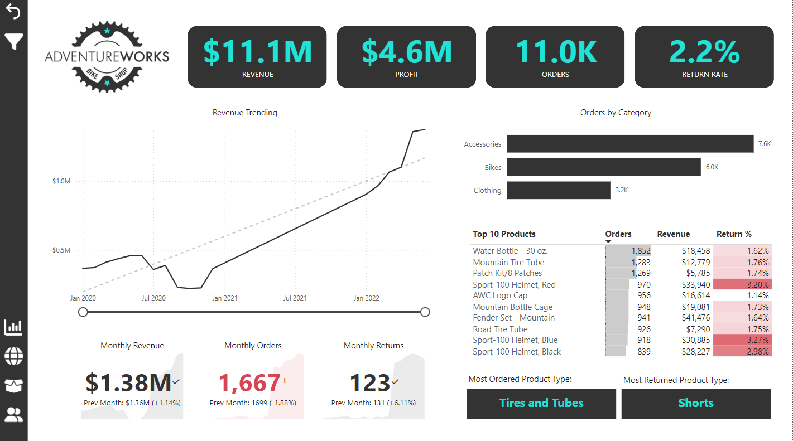

# AdventureWorks Sales Performance Dashboard

## Overview

This Power BI dashboard was developed to provide a comprehensive view of **AdventureWorks** sales performance from **2020 to 2022**. It offers insights into the company's key metrics such as **Revenue**, **Profit**, **Orders**, and **Return Rate**, empowering users with actionable data to drive business decisions. The interactive design allows users to drill down into specific data points, gaining a deeper understanding of customer behavior, regional performance, and product popularity.

## Dashboard
### 1. **Executive Dashboard**

### 2. **Continent Map View of Sales**

## Features

### 1. **Sales Metrics Overview**

- The dashboard presents four core metrics—**Revenue**, **Profit**, **Orders**, and **Return Rate**—giving users a snapshot of overall sales performance.
  
- Each metric is visualized using **KPI Cards** to provide a quick, at-a-glance understanding of how the business is performing over time.

### 2. **Top Customer Insights**

- The dashboard identifies and highlights the **Top Customer** based on sales volume.  
- Displays key information about the customer:
  - Total **Orders**
  - **Revenue** generated
  - **Location** details
  
- This feature helps the sales team recognize key clients and track their purchasing behavior, offering a potential avenue for targeted marketing and relationship-building.

### 3. **Most Ordered and Returned Products**

- The dashboard showcases:
  - **Most Ordered Product Types** to indicate popular items driving sales.
  - **Most Returned Product Types**, giving insight into product quality or customer dissatisfaction.

- By analyzing these trends, businesses can make informed decisions on product stocking, inventory management, and customer service improvements.

### 4. **Dynamic Geographic Sales Analysis**

- **Interactive Map View** that allows users to see total orders at a continental level.
- Users can click on a continent (e.g., Europe) to drill down into sales performance by country.
  
- This feature enhances geographic analysis, allowing regional managers to assess market penetration and performance.

### 5. **Time-Based Performance Analysis**

- Users can filter data by **Year** (2020 to 2022), enabling year-over-year comparison of sales performance.
  
- The dashboard also supports **month-level filtering** for more granular time analysis, aiding in identifying trends or seasonal peaks and troughs in sales.

## Data Sources

The dashboard leverages sales data from **AdventureWorks** between **2020 and 2022**. This includes:

- **Order Data**: Contains information on orders made during this period.
- **Product Data**: Provides details on product categories, returns, and order volume.
- **Geographic Data**: Sales information linked to customer locations, helping with regional analysis.

## Interactive Visuals

The dashboard includes the following visual elements to enhance data exploration and analysis:

- **KPI Cards**: Display real-time values of key metrics such as Revenue, Profit, Orders, and Return Rate.
  
- **Bar and Line Charts**: These provide a comparative analysis of sales metrics over time, making it easy to track trends and performance shifts.

- **Geographic Heat Map**: Allows users to see sales volume per continent and country. Clicking on a region dynamically filters the dashboard to show detailed sales insights for the selected area.

- **Pie Charts**: Used to display the breakdown of product types, highlighting both the most ordered and returned products.

## User Interactions

### Drill-Down and Filter Capabilities

- **Drill-down** functionality is available for most charts and graphs, allowing users to move from a high-level view (e.g., continent) to more detailed data (e.g., country-specific sales).
  
- **Filters**: The dashboard provides interactive filters for year and product type, giving users flexibility in how they analyze the data.

- **Hover Insights**: Hovering over visuals shows detailed tooltips with additional data points, offering quick information without overwhelming the view.

## Technology Stack

- **Power BI**: The primary platform for data visualization and dashboard creation.
- **Data Modeling**: Managed within Power BI to establish relationships between different data tables and ensure seamless filtering.
- **Power Query**: Utilized for data cleaning and transformation.

## Benefits

This dashboard serves several critical purposes for **AdventureWorks**:

- **Enhanced Decision-Making**: With clear visuals and interactive components, the dashboard empowers management to make data-driven decisions.
  
- **Customer and Product Insights**: Detailed information on top customers and product performance helps in refining marketing strategies and improving product offerings.
  
- **Geographic Performance Analysis**: The map view helps assess the success of different regions, aiding in regional strategy development.

- **Time-Based Trend Analysis**: Historical data filtering supports understanding of sales trends and forecasting future performance.

## How to Use

1. **Filter the Time Period**: Select the desired year or month to view sales performance for that time.
   
2. **Examine Key Metrics**: Start with the KPI cards to get an overview of how revenue, profit, orders, and return rates are performing.

3. **Explore Top Customer & Product Data**: Click through the Top Customer and Product visualizations to dive into detailed customer behavior and product success metrics.

4. **Geographic Insights**: Use the map view to explore sales across different regions and countries.

5. **Drill Down for Detail**: Use the drill-down feature to gain deeper insights into specific areas of interest.

## Future Enhancements

- **Predictive Analysis**: Incorporating machine learning models to forecast future sales performance based on historical data.

- **Automated Alerts**: Setting up automated email alerts or notifications for key changes in metrics (e.g., sudden drops in profit or spikes in returns).

- **Customer Segmentation**: Adding a segmentation analysis to categorize customers based on their purchasing behavior and profitability.

## Conclusion

The AdventureWorks Sales Performance Dashboard is an essential tool for gaining actionable insights into the company’s sales data. It equips decision-makers with the power to monitor business health, spot trends, and make informed decisions based on real-time data.

---

**Created by: [Sam Joe Silvano P]**  
Data Scientist | Power BI Enthusiast
